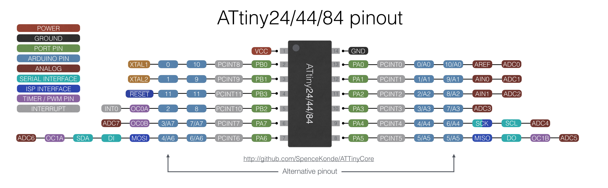

## Embedded Programming

- architectures
  - [von Neumann](https://www.javatpoint.com/von-neumann-model), [Harvard](https://www.geeksforgeeks.org/harvard-architecture/)
  - [RISC](https://binaryterms.com/risc-processor.html), [CISC](https://binaryterms.com/cisc-processors.html)
  - microprocessor, microcontroller
  - [GPU](https://www.hellotech.com/blog/whats-a-gpu-what-gpu-do-you-have), [TPU](https://analyticsindiamag.com/tpu-beginners-guide-google/)
  - [FPGA](https://www.xilinx.com/products/silicon-devices/fpga/what-is-an-fpga.html), [TinyFPGA](https://tinyfpga.com/), [ASICs](https://www.elprocus.com/application-specific-integrated-circuits/), [difference](https://numato.com/blog/differences-between-fpga-and-asics/)

- memory
  - registers (instructions)
  - SRAM (fast)
  - DRAM (big)
  - EEPROM (non-volatile)
  - FLASH (programs, strings)
  - fuse (configuration)

- peripherals
  - ports
  - A/D
  - comparator
  - D/A
  - timer/counter/PWM
  - USART
  - USB
  - ...

- word size
  - 8
  - 16
  - 32
  - 64

- families
  - [8051](http://www.faqs.org/faqs/microcontroller-faq/8051/)
  - [PIC](https://www.microchip.com/design-centers/microcontrollers)
  - [MSP](http://www.ti.com/lsds/ti/microcontroller/16-bit_msp430/overview.page)
  - [AVR](https://www.microchip.com/design-centers/8-bit/microchip-avr-mcus)
    - [MCU Quick Reference Guide](https://ww1.microchip.com/downloads/en/DeviceDoc/30010135E.pdf)
    - [ATtiny412](https://www.digikey.com/product-detail/en/microchip-technology/ATTINY412-SSFR/ATTINY412-SSFRCT-ND),  [ATtiny45](http://www.digikey.com/product-detail/en/ATTINY45V-10SU/ATTINY45V-10SU-ND)
    - [ATtiny1614](https://www.digikey.com/product-detail/en/microchip-technology/ATTINY1614-SSNR/ATTINY1614-SSNRCT-ND), [ATtiny44](http://www.digikey.com/product-detail/en/ATTINY44A-SSU/ATTINY44A-SSU-ND)
    - [ATtiny3216](https://www.digikey.com/product-detail/en/microchip-technology/ATTINY3216-SFR/ATTINY3216-SFRCT-ND), [ATmega328](https://www.digikey.com/en/products/detail/microchip-technology/ATMEGA328PB-AU/5638812)
   - ARM
     - [D11C](https://www.digikey.com/products/en?keywords=ATSAMD11C14A-SSUTCT-ND), [D11D](https://www.digikey.com/products/en?keywords=ATSAMD11D14A-SSUTCT-ND)
   - Xtensa
     - [ESP8266](https://www.espressif.com/en/products/hardware/esp8266ex/overview)
     - [ESP32](https://www.espressif.com/en/products/hardware/esp32/overview)
   - PSoC, xCORE, Propeller, Lattice, NVIDIA
   - [RISC-V](https://cacm.acm.org/magazines/2020/5/244325-will-risc-v-revolutionize-computing/fulltext)

- Articles
  - [Getting Started with the new ATtiny chips](http://www.technoblogy.com/show?2OCH)
  - [Fabricable Arduino boards](https://fabacademy.org/archives/2015/doc/projects/satshakit/satshakit.html)

- vendors
  - [Octopart](http://octopart.com/)
  - [DigiKey](https://www.digikey.sg/)
  - [Mouser](https://www.mouser.sg/)
  - [RS Components](https://uk.rs-online.com/web/)
  - [Element14](https://sg.element14.com/)
  - [SparkFun](http://www.sparkfun.com/)
  - [Adafruit](https://www.adafruit.com/)

- [packages](https://www.microchip.com/en-us/support/package-drawings)
  - DIP
  - SOT
  - SOIC
  - TSSOP
  - TQFP
  - LQFP
  - BGA

- in-system development
  - ISP (AVR)
    - software
      - [avrdude](http://www.nongnu.org/avrdude/)
    - hardware
      - [header](http://www.mouser.com/ProductDetail/FCI/95278-101A06LF/?qs=sGAEpiMZZMtsLRyDR9nM14Vjyw4ze%252bjt4BkljYq5qeM%3d) [pads](http://academy.cba.mit.edu/classes/embedded_programming/hello.ISP.44.traces.png) [clip](http://www.digikey.com/product-detail/en/3m/923655-14/923655-14-ND) [pins](http://fab.cba.mit.edu/classes/863.16/doc/projects/Pogo_prog_connector/Pogo.html)
      - [Atmel-ICE](http://www.digikey.com/product-detail/en/ATATMEL-ICE-BASIC/ATATMEL-ICE-BASIC-ND)
      - [Arduino](https://www.arduino.cc/en/Main.ArduinoISP)
      - ATmega16U2-based ISP/PDI programmer [Zaerc](https://gitlab.fabcloud.org/FabISPmk2/FabPDI)
      - FabtinyISP: [Brian](http://fab.cba.mit.edu/classes/863.16/doc/projects/ftsmin/index.html)
  - UPDI (AVR 0,1-series)
    - software
      - [pyupdi](https://github.com/mraardvark/pyupdi)
           install: pip3 install intelhex pylint pyserial
           
           program: python3 pyupdi.py -d your_processor -c your_port -b your_baud_rate -f your_hex -v
           
      - hardware
        - [hello.serial-UPDI.FT230X](http://academy.cba.mit.edu/classes/embedded_programming/UPDI/FTDI-UPDI) [board](http://academy.cba.mit.edu/classes/embedded_programming/UPDI/FTDI-UPDI.png) [components](http://academy.cba.mit.edu/classes/embedded_programming/UPDI/FTDI-UPDI.jpg) [traces](http://academy.cba.mit.edu/classes/embedded_programming/UPDI/FTDI-UPDI.traces.png) [interior](http://academy.cba.mit.edu/classes/embedded_programming/UPDI/FTDI-UPDI.interior.png)
        - [hello.USB-UPDI.FT230X](http://academy.cba.mit.edu/classes/embedded_programming/FTDI/USB-FT230XS-UPDI) [board](http://academy.cba.mit.edu/classes/embedded_programming/FTDI/USB-FT230XS-UPDI.png) [components](http://academy.cba.mit.edu/classes/embedded_programming/FTDI/USB-FT230XS-UPDI.jpg) [traces](http://academy.cba.mit.edu/classes/embedded_programming/FTDI/USB-FT230XS-UPDI.traces.png) [interior](http://academy.cba.mit.edu/classes/embedded_programming/FTDI/USB-FT230XS-UPDI.interior.png)
        - [Arduino nano](https://github.com/SpenceKonde/megaTinyCore/blob/master/MakeUPDIProgrammer.md)
  - JTAG (ARM)
    - software
      - [OpenOCD]j(http://openocd.org/)
      - [EDBG](https://github.com/ataradov/edbg)
           program: edbg -b -t target_type -pv -f binary_file
           read fuses: edbg -b -t target_type -F r,*,file_name
           write fuses: edbg -b -t target_type -F w,high_bit:low_bit,bit_value
    - hardware
      - [Atmel-ICE](http://www.digikey.com/product-detail/en/ATATMEL-ICE-BASIC/ATATMEL-ICE-BASIC-ND)
      - [PICO](https://www.digikey.com/product-detail/en/maxim-integrated/MAX32625PICO/MAX32625PICO-ND/7560410)
      - [GoodFET](http://goodfet.sourceforge.net/)
      - [Raspberry Pi](https://learn.adafruit.com/programming-microcontrollers-using-openocd-on-raspberry-pi/overview)
      - [Free-DAP](https://github.com/ataradov/free-dap)
            [hello.CMSIS-DAP.10.D11C](http://academy.cba.mit.edu/classes/embedded_programming/SWD/hello.CMSIS-DAP.10.D11C) [board](http://academy.cba.mit.edu/classes/embedded_programming/SWD/hello.CMSIS-DAP.10.D11C.png) [components](http://academy.cba.mit.edu/classes/embedded_programming/SWD/hello.CMSIS-DAP.10.D11C.jpg) [traces](http://academy.cba.mit.edu/classes/embedded_programming/SWD/hello.CMSIS-DAP.10.D11C.traces.png) [interior](http://academy.cba.mit.edu/classes/embedded_programming/SWD/hello.CMSIS-DAP.10.D11C.interior.png)
            [hello.CMSIS-DAP.4.D11C](http://academy.cba.mit.edu/classes/embedded_programming/SWD/hello.CMSIS-DAP.4.D11C) [board](http://academy.cba.mit.edu/classes/embedded_programming/SWD/hello.CMSIS-DAP.4.D11C.png) [components](http://academy.cba.mit.edu/classes/embedded_programming/SWD/hello.CMSIS-DAP.4.D11C.jpg) [traces](http://academy.cba.mit.edu/classes/embedded_programming/SWD/hello.CMSIS-DAP.4.D11C.traces.png) [interior](http://academy.cba.mit.edu/classes/embedded_programming/SWD/hello.CMSIS-DAP.4.D11C.interior.png)
            [hello.SWD.10-4](http://academy.cba.mit.edu/classes/embedded_programming/SWD/hello.SWD.10-4) [board](http://academy.cba.mit.edu/classes/embedded_programming/SWD/hello.SWD.10-4.png) [components](http://academy.cba.mit.edu/classes/embedded_programming/SWD/hello.SWD.10-4.jpg) [traces](http://academy.cba.mit.edu/classes/embedded_programming/SWD/hello.SWD.10-4.traces.png) [interior](http://academy.cba.mit.edu/classes/embedded_programming/SWD/hello.SWD.10-4.interior.png)
               [binary](http://academy.cba.mit.edu/classes/embedded_programming/SWD/free_dap_d11c_mini.bin) [video](http://academy.cba.mit.edu/classes/embedded_programming/SWD/hello.CMSIS-DAP.4.D11C.mp4)
   - [bootloader](https://github.com/arduino/Arduino/wiki/Unofficial-list-of-3rd-party-boards-support-urls) (all)

- assembly language
  - [hex file](http://fab.cba.mit.edu/about/fab/hello/ftdi/hello.ftdi.44.echo.hex)
  - [instruction set](http://academy.cba.mit.edu/classes/embedded_programming/doc0856.pdf), opcodes
  - [mnemonics](http://academy.cba.mit.edu/classes/embedded_programming/doc1022.pdf), [directives](http://academy.cba.mit.edu/classes/embedded_programming/doc1022.pdf), [expressions](http://academy.cba.mit.edu/classes/embedded_programming/doc1022.pdf)
  - [avr-as](http://www.nongnu.org/avr-libc/user-manual/overview.html)
  - [inline](http://www.nongnu.org/avr-libc/user-manual/inline_asm.html)

- C
  - [programming](https://gitlab.fabcloud.org/academany/fabacademy/2020/recitations/blob/master/programming.pdf)
  - [GCC](http://gcc.gnu.org/)
    -  [make files](https://www.gnu.org/software/make/manual/html_node/Introduction.html#Introduction)
    -  [bit operations](http://playground.arduino.cc/Code/BitMath)
  - AVR
    - [libc](http://www.nongnu.org/avr-libc/user-manual/index.html) [modules](http://www.nongnu.org/avr-libc/user-manual/modules.html) [types](http://www.nongnu.org/avr-libc/user-manual/group__avr__stdint.html) [math](http://www.nongnu.org/avr-libc/user-manual/group__avr__math.html) [benchmarks](http://www.nongnu.org/avr-libc/user-manual/benchmarks.html)
    - [avr-libc](http://packages.ubuntu.com/xenial/avr-libc) [binutils-avr](http://packages.ubuntu.com/xenial/binutils-avr) [gcc-avr](http://packages.ubuntu.com/xenial/gcc-avr)
    - [homebrew-avr](https://github.com/osx-cross/homebrew-avr)
  - ARM
    - [gcc-arm-none-eabi](http://packages.ubuntu.com/xenial/gcc-arm-none-eabi) [gdb-multiarch](http://packages.ubuntu.com/xenial/gdb-multiarch)
    - [homebrew-arm](https://github.com/osx-cross/homebrew-arm)
  - Microchip
    - [ASF](https://asf.microchip.com/docs/latest)
    - [Studio](https://www.microchip.com/avr-support/atmel-studio-7)
    - [toolchains](https://www.microchip.com/mplab/avr-support/avr-and-arm-toolchains-c-compilers) [packs](http://packs.download.atmel.com/)

- IDE
  - [Atmel Studio](https://www.microchip.com/avr-support/atmel-studio-7)
  - [Arduino](https://www.arduino.cc/en/Main/Software)
  - [Eclipse AVR](http://www.eclipse.org/)
  - [Firefly](http://www.grasshopper3d.com/profile/firefly)
  - [Scratch](http://wiki.scratch.mit.edu/wiki/PicoBoard)
  - [Modkit](http://www.modk.it/)

- [boards](https://pub.pages.cba.mit.edu/ring)
  - [Atmel](http://www.digikey.com/product-detail/en/ATXMEGAE5-XPLD/ATXMEGAE5-XPLD-ND) 
  - [Adafruit](https://www.adafruit.com/product/46) 
  - [Sparkfun](https://www.sparkfun.com/categories/1) 
  - [Polulu](https://www.pololu.com/category/149/a-star-programmable-controllers) 
  - [MattairTech](https://www.mattairtech.com/)

- [Arduino](http://www.arduino.cc/)
  - board + toolchain + libraries + IDE + bootloader + header
  - programming
    - [C++](https://arduino.github.io/arduino-cli/latest/sketch-build-process/) 
    - [Create](https://create.arduino.cc/) 
    - [Codebender](https://codebender.cc/) 
    - [Ardublock](http://blog.ardublock.com/)
  - original
    - [Fabkit](http://archive.fabacademy.org/archives/2016/doc/projects/fabkit-0.4.html) 
    - [Fabio](http://makeyourbot.wikidot.com/fabio-1-1) 
    - [satshakit](https://github.com/satshakit) 
    - [hello.328P](http://academy.cba.mit.edu/classes/embedded_programming/hello.arduino.328P.png)
  - [cores](https://www.arduino.cc/en/guide/cores)
    - [ATtiny](https://github.com/SpenceKonde/ATTinyCore) 
    - [tinyAVR](https://github.com/SpenceKonde/megaTinyCore) 
    - [SAMD](https://github.com/mattairtech/ArduinoCore-samd) 
    - [ESP8266](https://github.com/esp8266/Arduino) 
    - [ESP32](https://github.com/espressif/arduino-esp32)

- clocks
  - types
    - RC (10%, 1% calibrated)
    - ceramic (0.5%)
    - quartz (50 ppm)
  - PLL
  - [Crystal](https://www.digikey.com/en/products/detail/ndk-america-inc/NX5032GA-20-000000MHZ-LN-CD-1/1128821?s=N4IgTCBcDaIGwBYEFoCMAGAzATjcgcgCIgC6AvkA), [Resonator](https://www.digikey.com/en/products/detail/ecs-inc/ECS-CR2-20-00-B-TR/813196?s=N4IgTCBcDaIBoGECMSAMBOBAVAtAOQBEQBdAXyA), [difference](https://www.rfwireless-world.com/Terminology/Crystal-vs-Resonator.html)
 
- host communication
  - [RS232](http://academy.cba.mit.edu/classes/embedded_programming/serial.png)
    - bit timing
  - [VT100/ANSI/ISO/ECMA terminal](http://academy.cba.mit.edu/classes/embedded_programming/Ecma-048.pdf)
    - [Minicom](http://alioth.debian.org/projects/minicom/) 
    - [Arduino](https://www.arduino.cc/reference/en/language/functions/communication/serial) 
    - [Putty](https://www.ssh.com/ssh/putty/)

  - [USB](http://www.usb.org/home)
    - software
      -  [V-USB](http://www.obdev.at/products/vusb/index.html)
    - hardware
      - [LUFA](http://www.fourwalledcubicle.com/LUFA.php) [ASF](https://asf.microchip.com/docs/latest/asf_usb.html) [Arduino](https://www.arduino.cc/en/Reference/Libraries)
  - [FTDI](http://www.ftdichip.com/)
    - [drivers](https://www.ftdichip.com/FTDrivers.htm)
    - [libFTDI](http://www.intra2net.com/en/developer/libftdi/) [zadig](https://zadig.akeo.ie/)
     - [cable](https://www.digikey.com/product-detail/en/ftdi-future-technology-devices-international-ltd/TTL-232R-5V/768-1028-ND)
    - [chip](https://www.ftdichip.com/Products/ICs/FT230X.html)
      - [hello.USB-serial.FT230X](http://academy.cba.mit.edu/classes/embedded_programming/FTDI/USB-FT230XS-serial) [board](http://academy.cba.mit.edu/classes/embedded_programming/FTDI/USB-FT230XS-serial.png) [components](http://academy.cba.mit.edu/classes/embedded_programming/FTDI/USB-FT230XS-serial.jpg) [traces](http://academy.cba.mit.edu/classes/embedded_programming/FTDI/USB-FT230XS-serial.traces.png) [interior](http://academy.cba.mit.edu/classes/embedded_programming/FTDI/USB-FT230XS-serial.interior.png)
    - [CH340G, CH340E](https://www.mpja.com/download/35227cpdata.pdf) [drivers](https://sparks.gogo.co.nz/ch340.html)
   

- [ATtiny412](http://academy.cba.mit.edu/classes/embedded_programming/t412/40001911A.pdf)
  - [hello.t412.blink](http://academy.cba.mit.edu/classes/embedded_programming/t412/hello.t412.blink.png) [components](http://academy.cba.mit.edu/classes/embedded_programming/t412/hello.t412.blink.jpg) [traces](http://academy.cba.mit.edu/classes/embedded_programming/t412/hello.t412.blink.traces.png) [interior](http://academy.cba.mit.edu/classes/embedded_programming/t412/hello.t412.blink.interior.png) 
        timing [blink.ino](http://academy.cba.mit.edu/classes/embedded_programming/t412/hello.t412.blink.ino) [video](http://academy.cba.mit.edu/classes/embedded_programming/t412/hello.t412.blink.mp4)
  - [hello.t412.echo](http://academy.cba.mit.edu/classes/embedded_programming/t412/hello.t412.echo.png) [components](http://academy.cba.mit.edu/classes/embedded_programming/t412/hello.t412.echo.jpg) [traces](http://academy.cba.mit.edu/classes/embedded_programming/t412/hello.t412.echo.traces.png) [interior](http://academy.cba.mit.edu/classes/embedded_programming/t412/hello.t412.echo.interior.png) 
        UART [echo.ino](http://academy.cba.mit.edu/classes/embedded_programming/t412/hello.t412.echo.ino) [video](http://academy.cba.mit.edu/classes/embedded_programming/t412/hello.t412.echo.mp4)
  - Pinout (for Arduino IDE)
    
- [ATtiny45](http://academy.cba.mit.edu/classes/embedded_programming/Atmel-2586-AVR-8-bit-Microcontroller-ATtiny25-ATtiny45-ATtiny85_Datasheet.pdf)
  - [hello.ftdi.45](http://academy.cba.mit.edu/classes/embedded_programming/hello.ftdi.45.png) [components](http://academy.cba.mit.edu/classes/embedded_programming/hello.ftdi.45.jpg) [traces](http://academy.cba.mit.edu/classes/embedded_programming/hello.ftdi.45.traces.png) [interior](http://academy.cba.mit.edu/classes/embedded_programming/hello.ftdi.45.interior.png) pin re-use 
        [ports](http://academy.cba.mit.edu/classes/embedded_programming/portwrite.html) [port.c](http://academy.cba.mit.edu/classes/embedded_programming/hello.ftdi.45.port.c) [port.make](http://academy.cba.mit.edu/classes/embedded_programming/hello.ftdi.45.port.make) [port.ino](http://academy.cba.mit.edu/classes/embedded_programming/hello.ftdi.45.port.ino) [port.write.ino](http://academy.cba.mit.edu/classes/embedded_programming/hello.ftdi.45.port.write.ino) 
        [echo.ino](http://academy.cba.mit.edu/classes/embedded_programming/hello.ftdi.45.echo.ino) [echo.serial.ino](http://academy.cba.mit.edu/classes/embedded_programming/hello.ftdi.45.echo.serial.ino) [video](http://academy.cba.mit.edu/classes/embedded_programming/hello.ftdi.45.echo.mp4)
  - Pinout (for Arduino IDE)
    

- [ATtiny1614](http://academy.cba.mit.edu/classes/embedded_programming/t1614/ATtiny1614-DataSheet-DS40001995B.pdf)
  - [hello.t1614.echo](http://academy.cba.mit.edu/classes/embedded_programming/t1614/hello.t1614.echo.png) [components](http://academy.cba.mit.edu/classes/embedded_programming/t1614/hello.t1614.echo.jpg) [traces](http://academy.cba.mit.edu/classes/embedded_programming/t1614/hello.t1614.echo.traces.png) [interior](http://academy.cba.mit.edu/classes/embedded_programming/t1614/hello.t1614.echo.interior.png) 
        [echo.ino](http://academy.cba.mit.edu/classes/embedded_programming/t1614/hello.t1614.echo.ino) [video](http://academy.cba.mit.edu/classes/embedded_programming/t1614/hello.t1614.echo.mp4)
  - Pinout (for Arduino IDE)
    

- [ATtiny44](http://academy.cba.mit.edu/classes/embedded_programming/8183s.pdf)
  - [hello.ftdi.44](http://academy.cba.mit.edu/classes/embedded_programming/hello.ftdi.44.png) [components](http://academy.cba.mit.edu/classes/embedded_programming/hello.ftdi.44.components.jpg) [traces](http://academy.cba.mit.edu/classes/embedded_programming/hello.ftdi.44.traces.png) [interior](http://academy.cba.mit.edu/classes/embedded_programming/hello.ftdi.44.interior.png)
  - Pinout (for Arduino IDE)
    

- [ATSAMD11C](http://academy.cba.mit.edu/classes/embedded_programming/D11C/atmel-42363-sam-d11_datasheet.pdf)
  - [hello.D11C.blink](http://academy.cba.mit.edu/classes/embedded_programming/D11C/hello.D11C.blink.png) [components](http://academy.cba.mit.edu/classes/embedded_programming/D11C/hello.D11C.blink.jpg) [traces](http://academy.cba.mit.edu/classes/embedded_programming/D11C/hello.D11C.blink.traces.png) [interior](http://academy.cba.mit.edu/classes/embedded_programming/D11C/hello.D11C.blink.interior.png) 
        [blink.c](http://academy.cba.mit.edu/classes/embedded_programming/D11C/hello.D11C.blink.c) [blink.make](http://academy.cba.mit.edu/classes/embedded_programming/D11C/hello.D11C.blink.make) [bootloader](https://github.com/mattairtech/ArduinoCore-samd/blob/master/bootloaders/zero/binaries/sam_ba_Generic_D11C14A_SAMD11C14A.bin) [blink.ino](http://academy.cba.mit.edu/classes/embedded_programming/D11C/hello.D11C.blink.ino) [video](http://academy.cba.mit.edu/classes/embedded_programming/D11C/hello.D11C.blink.mp4)

- Interpreters
  - [AVRSH](http://www.instructables.com/id/AVRSH-A-Command-Interpreter-Shell-for-ArduinoAVR/)
  - [BASIC](http://gcbasic.sourceforge.net/Typesetter/index.php/Home)
  - [FORTH](http://amforth.sourceforge.net/)
  - [Espruino](http://www.espruino.com/)
  - [MicroPython](https://micropython.org/) [CircuitPython](https://github.com/adafruit/circuitpython)

- [ESP8266](http://academy.cba.mit.edu/classes/networking_communications/ESP8266/0a-esp8266ex_datasheet_en.pdf)
  - [ESP-01](http://academy.cba.mit.edu/classes/networking_communications/ESP8266/esp01.pdf)
    - [hello.ESP-01](http://academy.cba.mit.edu/classes/networking_communications/ESP8266/hello.ESP-01.png) [components](http://academy.cba.mit.edu/classes/networking_communications/ESP8266/hello.ESP-01.jpg) [traces](http://academy.cba.mit.edu/classes/networking_communications/ESP8266/hello.ESP-01.traces.png) [holes](http://academy.cba.mit.edu/classes/networking_communications/ESP8266/hello.ESP-01.holes.png) [interior](http://academy.cba.mit.edu/classes/networking_communications/ESP8266/hello.ESP-01.interior.png) 
         [echo.ino](http://academy.cba.mit.edu/classes/networking_communications/ESP8266/hello.ESP-01.echo.ino) [video](http://academy.cba.mit.edu/classes/networking_communications/ESP8266/hello.ESP-01.echo.mp4)
  - [ESP-WROOM-02D](http://academy.cba.mit.edu/classes/networking_communications/ESP8266/esp-wroom-02d_esp-wroom-02u_datasheet_en-1365835.pdf)
    - [hello.ESP-WROOM-02D](http://academy.cba.mit.edu/classes/networking_communications/ESP8266/hello.ESP-WROOM-02D.png) [components](http://academy.cba.mit.edu/classes/networking_communications/ESP8266/hello.ESP-WROOM-02D.jpg) [traces](http://academy.cba.mit.edu/classes/networking_communications/ESP8266/hello.ESP-WROOM-02D.traces.png) [holes](http://academy.cba.mit.edu/classes/networking_communications/ESP8266/hello.ESP-WROOM-02D.holes.png) [interior](http://academy.cba.mit.edu/classes/networking_communications/ESP8266/hello.ESP-WROOM-02D.interior.png) 
         [echo.ino](http://academy.cba.mit.edu/classes/networking_communications/ESP8266/hello.ESP-WROOM-02D.echo.ino) [video](http://academy.cba.mit.edu/classes/networking_communications/ESP8266/hello.ESP-WROOM-02D.echo.mp4)
         [Python](http://docs.micropython.org/en/latest/esp8266/quickref.html) [video](http://academy.cba.mit.edu/classes/networking_communications/ESP8266/hello.ESP-WROOM-02D.Python.mp4)

- [ESP32](http://academy.cba.mit.edu/classes/networking_communications/ESP32/esp32_datasheet_en.pdf)
  - [ESP32-WROOM-32](http://academy.cba.mit.edu/classes/networking_communications/ESP32/esp32-wroom-32_datasheet_en.pdf)
    - [hello.ESP32-WROOM](http://academy.cba.mit.edu/classes/networking_communications/ESP32/hello.ESP32-WROOM.png) [components](http://academy.cba.mit.edu/classes/networking_communications/ESP32/hello.ESP32-WROOM.jpg) [traces](http://academy.cba.mit.edu/classes/networking_communications/ESP32/hello.ESP32-WROOM.traces.png) [holes](http://academy.cba.mit.edu/classes/networking_communications/ESP32/hello.ESP32-WROOM.holes.png) [interior](http://academy.cba.mit.edu/classes/networking_communications/ESP32/hello.ESP32-WROOM.interior.png) 
         [echo.ino](http://academy.cba.mit.edu/classes/networking_communications/ESP32/hello.ESP32-WROOM.echo.ino) [video](http://academy.cba.mit.edu/classes/networking_communications/ESP32/hello.ESP32-WROOM.echo.mp4) 
         [Python](http://docs.micropython.org/en/latest/esp32/quickref.html) [video](http://academy.cba.mit.edu/classes/networking_communications/ESP32/hello.ESP32-WROOM.Python.mp4)

- Operating Systems
  - [FreeRTOS](https://www.freertos.org/)
  - [TinyOS](https://github.com/tinyos/tinyos-main)
  - [Mbed OS](https://www.mbed.com/en/)
  - [ROS](http://www.ros.org/)

- Systems
  - [Rasberry Pi](http://www.raspberrypi.org/) [MATE](https://ubuntu-mate.org/)
  - [Beagle](http://beagleboard.org/)
  - [Micro:bit](https://microbit.org/)

- debugging
  - hardware
    - [Atmel ICE](https://www.microchip.com/DevelopmentTools/ProductDetails/atatmel-ice) 
    - inspect, reflow solder joints
    -  check component orientation, values
    -  verify data sheets
    -  confirm connector orientation
    -  measure supply voltages
    -  probe I/O signals
  - software
    - blink LED
    - add print statements
    - use embedded debugger
      - [gdb](http://www.gnu.org/software/gdb/), [ddd](http://www.gnu.org/software/ddd/)
      - [Atmel Studio](https://www.microchip.com/avr-support/atmel-studio-7)

- assignment
  - individual assignment:
    - read a microcontroller [data sheet](http://academy.cba.mit.edu/classes/embedded_programming/t412/40001911A.pdf)
    - program your board to do something,
    - with as many different programming languages
         and programming environments as possible

### Examples
- [Steven](http://archive.fabacademy.org/fabacademy2016/fablabsingapore/students/98/exercise08.html)
- [Adrian](http://fab.academany.org/2020/labs/leon/students/adrian-torres/week08.html)
- [Yeo GS](http://fab.academany.org/2020/labs/singapore/students/gausiong-yeo/exercise08.html)
- [Noel](http://fab.academany.org/2020/labs/singapore/students/noel-kristian/exercise08.html)
