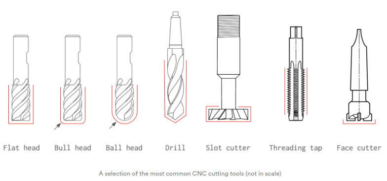
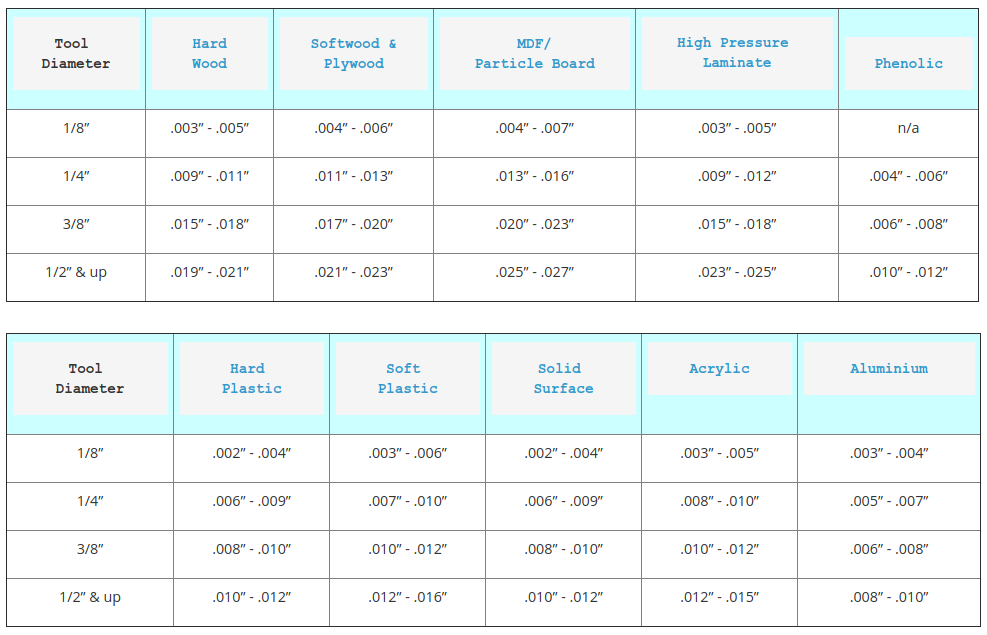

# Computer-Controlled Machining

## Quick References
- [Introduction to CNC](https://www.3dhubs.com/knowledge-base/cnc-machining-manufacturing-technology-explained/)
- [FablabSP CNC training materials](https://splms.polite.edu.sg/d2l/le/lessons/94979/lessons/3648077)
- [Makehaven CNC Milling I](https://docs.google.com/presentation/d/e/2PACX-1vQDCw06YwtPZXwY7lXZ5PmvVnK-_EOi2mXdK9fskMEipqkx9qXAdsPdtYPEdQXGj_RGMiMTxovjSRQo/pub?start=false&loop=false&delayms=3000#slide=id.p)
- [Makehaven CNC Milling II](https://docs.google.com/presentation/d/e/2PACX-1vQRnxj6gtvdpeoyxN-pd57x2Vbmz-79GqDKTcKUtWiQCUsRXuskwm3iiYPfCMugeHZOVaK1b3X5sf1F/pub?start=false&loop=false&delayms=3000#slide=id.p)

## projects
- [Standing Desk](https://www.forbes.com/sites/kerryflynn/2014/07/31/how-to-make-a-standing-desk-for-under-200-mit-grads-go-digital), [Opendesk](https://www.opendesk.cc/), [AtFab](http://atfab.co/)
- [Shelter 2.0](http://www.shelter20.com/), [yourHOUSE](http://blog.ted.com/digitally_fabbe/), [FabHouse](https://fablab.hochschule-rhein-waal.de/fabhouse-en), [Fab Lab House](https://archello.com/project/the-fab-lab-house)
- [Ikea Grow Room](https://mymodernmet.com/ikea-growroom-instructions/)
   
## machines
- [[Shaper](https://www.shapertools.com/)
- [ShopBot](https://www.shopbottools.com/)
- [EAS](http://panamech.com.my/im/versatile2500.htm)
- [Onsrud](https://www.cronsrud.com/cnc.html)
- [Haas](https://www.haascnc.com/index.html)
- [Fellesverkstedet](https://github.com/fellesverkstedet/fabricatable-machines)

## stock
- [rigid foam insulation](https://www.insulfoam.com/rigid-foam-insulation-types/)
- [veneer plywood](http://www.differencebetween.info/difference-between-plywood-and-veneer)
- [Medium Density Fiberboard (MDF)](https://www.bobvila.com/articles/what-is-mdf/)
- [HDPE](https://www.usplastic.com/catalog/item.aspx?itemid=23869)
- [Lexan, polycarbonate](https://www.acplasticsinc.com/categories/polycarbonate)
- [Aluminum (Composite Panel)](http://chipsoon.com/aluminium_composite.html)
- [delrin, POM](https://www.curbellplastics.com/Shop-Materials/All-Materials/Acetal/Delrin-Acetal-Sheet-Homopolymer-Color#?Shape=CRBL.SkuSheet)

## vendors
- [McMaster-Carr](https://www.mcmaster.com/raw-materials)
- [US Plastics](https://www.usplastic.com/)
- [Home Depot](http://www.homedepot.com/s/plywood)
- Singapore
  - [Easywood](https://www.plywood.com.sg/)
  - [Sin Joo Lee Timber](http://www.sinjoolee.com.sg/)
  - [Professional Plastics](https://www.professionalplastics.com/Singapore)
  - [Kings Materials](https://kingsmaterials.com.sg/polycarbonate-sheets/)
  - [Dama Trading](http://dama.com.sg/polycarbonate-sheets/)

## job shops
- [Plethora](https://www.plethora.com/)
- [Proto Labs](http://www.protolabs.com/)
- [Star Rapid](https://www.starrapid.com/)
- Singapore
  - [Mech-Tech Systems](https://mech-techsystems.com.sg/)
  - [Index Aerospace](https://indexaerospace.sg/cnc-machining-services/)
  - [Micro Tech CNC Engineering](http://www.wonghinglong.com.sg/services/cnc-machining/)
  - [IM Machinery Asia](https://www.im-machinery-asia.com.sg/)

## [tooling](https://makezine.com/2014/09/10/endmills/)
- drills vs mills
- router, V bits
- flutes
- coatings: HSS, carbide, TiCN, TiAlN, etc.
- center-cutting
- [up/down cut](https://www.cnccookbook.com/cnc-router-cutters-types-and-how-to-use-them/)
- flat/ball end
- vendors
  - [onsrud](https://www.onsrud.com/)
  - [Cutting Tools](https://www.lfc.com.sg/products/category/Cutting-tools?&page=all)
  - [sgtooling](https://sgtooling.com/collections/cutting-tools)
- [fablab inventory list](http://fab.cba.mit.edu/about/fab/inv.html)

## [speeds and feeds](http://new.industrialpress.com/machineryhandbook)
- chip load: ~ 0.001-0.010"
- feed rate (inches per minute) / (RPM x number of flutes) 
- cut depth: ~ tool diameter
- step-over: ~ tool diameter/2
- [Shopbot Feeds & Speeds charts](https://www.shopbottools.com/ShopBotDocs/files/FeedsandSpeeds.pdf)
- [CNC Cookbook Speeds & Feeds](https://www.cnccookbook.com/feeds-speeds/)
- [Mekanica: CNC Feeds & Speeds Explained](https://www.mekanika.io/blog/learn-1/cnc-feeds-speeds-explained-12)
- Cutter Shop: [Chip Load chart](https://cutter-shop.com/chip-load-chart/), [speeds & feed](https://cutter-shop.com/feeds-and-speeds-calculator/)
- [CBA - MIT Speeds & Feed calculator](https://pub.pages.cba.mit.edu/feed_speeds/)

## [lubricants](http://www.mcmaster.com/#machining-lubricants)

## [abrasive machining](http://www.mcmaster.com/#abrasive-powders), [grinding](https://www.grinding.com/)

## fixturing
- vises
- clamps
- screws
- [vacuum](https://www.cnccookbook.com/router-vacuum-table-cnc-diy/), [DIY vacuum table](http://fab.academany.org/2019/labs/ulb/students/axel-cornu/assignments/week08.html)
- wedges
- weights
- glue
- tape
- vendors
  - [Precise Tooling System](https://precisetooling.com.sg/)
  - [Hup Hong Machinery](https://huphong.com.sg/product-category/sharpening-machine-for-drill-bit-and-saw-blade/drill-bit-sharpener/?gclid=Cj0KCQiAwMP9BRCzARIsAPWTJ_HkEwYOyG8yE-DW-oIlQOKwXfd9nsxha0V2UYK01sb35UOG_jAQ4HwaAq4fEALw_wcB)
- [CNC fixturing tips](https://makezine.com/2016/06/20/7-cnc-fixturing-tips-small-shop/)

## sacrificial layers, [squaring](https://www.avidcnc.com/leveling-squaring-and-tramming-your-cnc-machine-p-438.html)

## [dust collection](https://makerindustry.com/cnc-router-dust-collection/)

## [flexures, living hinges](http://academy.cba.mit.edu/classes/computer_cutting/flexures.png), [kerf bending](https://makezine.com/2009/06/13/kerf-bending-for-cnc-millers/), [steam bending](https://www.google.com/search?q=steam+bending&tbm=isch)

## Joinery
- [Traditional Japanese joints](https://www.thingiverse.com/thing:169723)
- [Opendesk digitally remastered joinery](https://www.opendesk.cc/blog/digitally-remastered-joinery)

## [toolpaths](https://www.cnccookbook.com/complete-guide-to-cam-toolpaths-and-operations-for-milling-in-2020/)
- kerf, offset, runout
- [conventional, climb](https://www.machinemfg.com/climb-milling-vs-conventional-milling/)
- [rough/finish cuts](http://academy.cba.mit.edu/classes/computer_machining/cuts.png)
- high-speed, dry, ramping, [adaptive clearing](https://www.youtube.com/watch?v=1TgYz_LBdkw), swarf, rest
- one-sided, two-sided, registration
- 2, 2.5, 3, 4, 3+2, 5 axis
- tool length compensation
- cut depth, clearance, collisions
- [t-bone, dogbone](https://fablab.ruc.dk/more-elegant-cnc-dogbones/), [Fusion 360 dogbone](https://github.com/DVE2000/Dogbone)
- [tabs](https://www.wwgoa.com/video/cutting-cnc-tabs-router-table-015599/), [onion skinning](https://www.wwgoa.com/video/onion-skin-cutting-cnc-machine-015597/#)
- [nesting](https://www.shopsabre.com/everything-you-need-to-know-about-nesting-in-cnc-work/), [deepnest.io](https://deepnest.io/)
- lead-in, -out
- [test cuts](http://fab.academany.org/2020/labs/singapore/group.assignments/assignment05.html), cutting air
- [simulation](https://www.coursera.org/lecture/fusion-360-integrated-cad-cam-cae/toolpath-simulation-4nBmV)
- prototyping: [cardboard scale model](http://fab.academany.org/2020/labs/singapore/students/engting-kok/exercise07.html)
- [2D CNC milling toolpaths](https://www.autodesk.com/products/fusion-360/blog/10-2d-cnc-milling-toolpaths/)
- Opendesk Examples
  - [Design for CNC](https://www.opendesk.cc/blog/design-for-open-making-and-cnc-milling-machines)
  - [common cut types](https://www.opendesk.cc/blog/cnc-machines-and-common-cut-types)

## CAM
- [Fusion 360]
  - [CAM for CNC beginners](https://www.instructables.com/Fusion-360-CAM-Tutorial-for-CNC-Beginners/)
  - [CAM Basics](https://www.youtube.com/watch?v=lQ-MYnyxh7M)
  - [Nesting parts](https://www.youtube.com/watch?v=TIBMX-oVasU)
  - [Fusion 360 CAM Setup](https://www.instructables.com/CNC-Router-CAM-Setup/)
  - [CAM lessons](http://cadcamlessons.com/fusion-360-cam-tutorial/)
  - [Fusion 360 CAM overview](https://skippy.org.uk/wp-content/uploads/09_CAM.pdf)
- [VCarvePro](https://www.shopbottools.com/products/software)
  - [VCarvePro trial](https://www.vectric.com/free-trial/vcarve-pro)
  - [Getting Started - Wing Rib](https://www.vectric.com/support/tutorials/vcarve-pro?category=TutorialCategories&playlist=GettingStarted)
  - [Importing vectors - 3 Legged table](https://www.vectric.com/support/tutorials/vcarve-pro?category=TutorialCategories&playlist=VectorDrawing)
  - [2D toolpaths - 3 Legged table](https://www.vectric.com/support/tutorials/vcarve-pro?category=TutorialCategories&playlist=2DToolpaths)
  - [VCarve Pro for Beginners](https://www.youtube.com/watch?v=qt0CPmxFH0s)
  - [Beginner CNC](https://www.youtube.com/watch?v=l1oh8nekPu4)
- [FeatureCAM](http://www.featurecam.com/)
- [Mastercam](http://www.mastercam.com/en-us/)
- [HSMWorks](http://www.hsmworks.com/)
- [CAMWorks](https://camworks.com/)
- [Freecad Path](https://www.freecadweb.org/wiki/Path_Workbench)
- [Solidworks CAM](https://www.solidworks.com/product/solidworks-cam)
- [mods](https://skeatz.github.io/mods-sc/) [outline](http://academy.cba.mit.edu/classes/computer_machining/2D.mp4) [rough](http://academy.cba.mit.edu/classes/computer_machining/2.5D.mp4) [finish](http://academy.cba.mit.edu/classes/computer_machining/3D.mp4)

## file formats
- [.rml](http://academy.cba.mit.edu/classes/computer_machining/sample.rml)
- [.sbp](http://academy.cba.mit.edu/classes/computer_machining/sample.sbp)
- [.g, .nc, .tap](http://academy.cba.mit.edu/classes/computer_machining/sample.g)
- [Omax .ord](http://academy.cba.mit.edu/classes/computer_machining/sample.ord)
- viewers
  - [CAMotics](https://camotics.org/)
  - [NC Viewer](https://ncviewer.com/)
- understanding gcode
  - [How to read gcode](https://makezine.com/2016/10/24/get-to-know-your-cnc-how-to-read-g-code/)
  - [How to write CNC program](https://technogilesolutions.com/2020/09/how-to-write-a-cnc-part-program/)
  - [gcode cheat sheet](https://www.probotix.com/wiki/images/b/bd/G-codes_cheatsheet.pdf)

## [safety](http://www.popularmechanics.com/home/skills/yale-students-tragic-death-prompts-a-shop-safety-review)
- [training](https://esp.sp.edu.sg/webapps/blackboard/content/listContent.jsp?course_id=_51997_1&content_id=_1547283_1)
- cuts, burns, impacts, [fires](http://fab.academany.org/2018/labs/fablabspinderihallerne/students/claus-nicolaisen/portfolio/week8/log.html)
- glasses, shoes, clothes, hair, gloves
- look, listen
- don't reach into a powered tool
- emergency stop, assistance

## Note:
- EAS Versatil has a post-processor setup for Fusion 360.
  - Click [here](nceasy.cps) for the link. 
  - Download the zip file **nceasy.cps** and move it to your post-processor folder.
  - [Installing personal post processors in Fusion 360](https://knowledge.autodesk.com/support/fusion-360/learn-explore/caas/sfdcarticles/sfdcarticles/How-to-add-a-Post-Processor-to-your-Personal-Posts-in-Fusion-360.html)

## assignment
- document speeds & feeds calculation, recommended speeds/feeds for plywood, recommended kerf for machining [kerf test example](cnc-kerfing_12mm.zip) 
- make (design+mill+assemble) something big, documenting your design process, generating the cam toolpath, machining and assembly process
- Fusion 360 CAM examples
  - [Flat pack stool](https://www.youtube.com/watch?v=DHrP1MunhFw)
  - [Flat pack shoerack](https://www.youtube.com/watch?v=VJWz-exP4iY)
  - [Flat pack table](https://www.instructables.com/lesson/Flat-Pack-Table-Design/)
- Examples of assignment
  - [noel](http://fab.academany.org/2020/labs/singapore/students/noel-kristian/exercise07.html)
  - [ting](http://fab.academany.org/2020/labs/singapore/students/engting-kok/exercise07.html)
