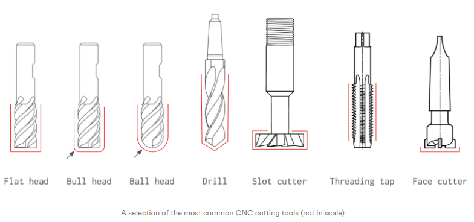

# 3D Machining

## [machining](http://academy.cba.mit.edu/classes/computer_machining/index.html)
- [surface finish](http://fab.cba.mit.edu/classes/863.18/Architecture/people/rodrigo/#/week-7-molding-and-casting)
- [rough, finish, stepover](http://academy.cba.mit.edu/classes/computer_machining/cuts.png)
- tool types

  - flat end
  - ball end
  - extra long, long neck, tapered
  - micro
- cut depth, shank, collet, collision, slope

## software
- [VCarve Pro](https://www.shopbottools.com/products/software)
- [Fusion 360](http://www.autodesk.com/products/fusion-360/overview) [Moldflow](https://www.autodesk.com/products/moldflow/overview)
  - [CNC Basics](https://www.instructables.com/Fusion-360-CAM-Tutorial-for-CNC-Beginners/)
  - [Essential CAM toolpaths](https://www.bantamtools.com/blog/three-essential-cam-toolpaths-in-fusion-360)
  - [Fundamentals of CAM workspace](https://www.google.com/url?sa=t&rct=j&q=&esrc=s&source=web&cd=&ved=2ahUKEwiX8sSdoqntAhXf6XMBHZyOAhMQFjAJegQIChAC&url=https%3A%2F%2Fd1ozhi4p59900.cloudfront.net%2Ffiles%2Furn%3Aadsk.content%3Alibrary%3A78756fcf-e6f3-4184-abdd-04afc0337a02%2FClassHandoutMFG226547LFundamentalsoftheCAMWorkspaceUsingFusion360Learn2Dand3DToolpathsKevinLee.pdf%3FExpires%3D1609459199%26Signature%3DjO5Wc19P5b57PfwqCwzM7Xos6nJfLKTTjv-tJABMcpXD9XMWcEWdiuUbq3QOWT9gly2kqw-H0O9GxMzNwKDLnsKBYsana60QK47B8~ad0cxMmtaKhg31BljLFimnswN0ibaKLLP1NUlJodbDe2rD~pFSfhYeWHlzxb~XL-xbuzZN3fjshRJsYX3FExCs4o6TiYe6xqK-qDc0rKchZg2uUevL22h1r9osLElBaNPaMVqf~Kxc82Koqxm-nXarI1L5E8MSpXL3J6FjHA6FQyEPOmrFPb79V8NL9O6qcPC7WyqDfdAyK23OwGNg0zTJRjG~m5xOs6frYp-SfcXYBUMnQA__%26Key-Pair-Id%3DAPKAIA22NYYFU6JZR5ZA&usg=AOvVaw1wPol6Kh209LsIU1CYYi6A)
- Solidworks [CAM](https://www.solidworks.com/product/solidworks-cam) [Plastics](https://www.solidworks.com/product/solidworks-plastics)
- [mods](https://skeatz.github.io/mods/) [community](https://fabfoundation.github.io/mods/) [rough](http://academy.cba.mit.edu/classes/computer_machining/2.5D.mp4) [finish](http://academy.cba.mit.edu/classes/computer_machining/3D.mp4)

## assignment
- review the safety data sheets for each of your molding and casting materials
- design a mold around the stock and tooling that you'll be using,
- mill it (rough cut + (at least) three-axis finish cut),
- and use it to cast parts

## examples
- [Marwa](http://fabacademy.org/2020/labs/kamplintfort/students/marwa-baalouche/class10.html)
- [Kais](http://fabacademy.org/2020/labs/kamplintfort/students/kais-alila/assignments/week10/)
- [Kok Eng](http://fab.academany.org/2020/labs/singapore/students/engting-kok/exercise15.html)
- [Noel](http://fab.academany.org/2020/labs/singapore/students/noel-kristian/exercise15.html)
